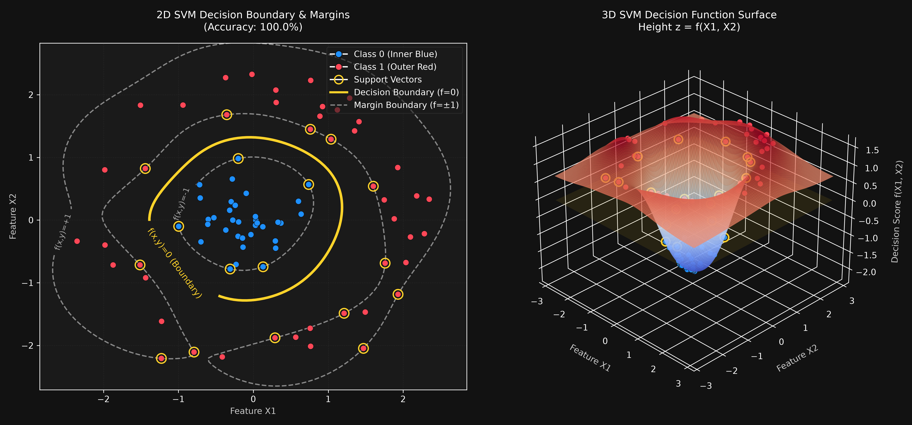

# SVM Kernel Trick 3D Interactive Demo (支援向量機核技巧與 3D 互動教學工具)

This project is an educational package designed to help students and educators visualize the concepts of **Support Vector Machines (SVM)** and the **Kernel Trick**. It provides three levels of learning materials: a concept animation (Manim), a static/executable Python visualization (Matplotlib), and a fully interactive web application (Streamlit & Plotly).

本專案是一個針對支援向量機 (SVM) 與「核技巧」設計的教學工具包，提供三種維度的學習教材：概念動畫、實體模型二維/三維視覺化、以及互動式教學網頁。

---

## Repository Structure (目錄結構)

```
d:\cena\0618\HW8/
├── requirements.txt                   # Dependency packages list
├── README.md                          # Documentation and instructions (This file)
├── phase1_manim_kernel_trick.py       # Phase 1: Manim CE animation script
├── phase2_rbf_decision_surface.py     # Phase 2: Real RBF SVM decision surface script
├── phase3_streamlit_app.py            # Phase 3: Streamlit interactive web app
└── utils/
    ├── __init__.py
    ├── data_generator.py              # Ring dataset generator
    └── svm_utils.py                   # SVM model and grid calculation helpers
```

---

## Installation (環境安裝)

To run the interactive web app (Phase 3) or static plot (Phase 2), install the base packages:
請執行以下命令安裝基礎套件（適用於 Phase 2 與 Phase 3）：

```bash
pip install -r requirements.txt
```

### For Phase 1 (Local Manim Animation Only)
To render the 3D concept video locally, you need to install `manim` separately:
若您需要在本地端執行 Phase 1 的 3D 動畫，請單獨安裝 `manim`：

```bash
pip install manim
```

*Note: The `manim` package was removed from `requirements.txt` to prevent Streamlit Cloud deployment build failures, as it requires heavy C-system libraries (e.g., Cairo, X11, Pango) that are missing in cloud build environments. Running Manim locally also requires system-level dependencies like FFmpeg and a LaTeX distribution (e.g., MiKTeX, MacTeX).*

*備註：我們已將 `manim` 從預設的 `requirements.txt` 中移除，以避免在 Streamlit Cloud 部署時因缺乏系統級編譯器與 C 函式庫（如 Cairo, X11, Pango）而導致部署失敗。在本地執行 Manim 還需要另外安裝系統級的 FFmpeg 與 LaTeX 軟體套件。*

---

## Execution Commands (執行指令)

### Phase 1: Manim Concept Animation
Runs the mathematical concept animation where circularly separable 2D data is lifted to a 3D paraboloid and separated by a hyperplane.

- **Low quality preview (快速預覽):**
  ```bash
  manim -pql phase1_manim_kernel_trick.py SVMKernelTrick3D
  ```
- **High quality render (高畫質輸出):**
  ```bash
  manim -pqh phase1_manim_kernel_trick.py SVMKernelTrick3D
  ```

### Phase 2: Real RBF SVM Decision Surface
Trains a real `SVC(kernel='rbf')` on a noisy ring dataset and displays the 2D decision boundary alongside the 3D confidence decision surface.
執行真實的 RBF SVM 訓練，並產出 Matplotlib 二維/三維視覺化圖表：
```bash
python phase2_rbf_decision_surface.py
```
*(The plot will be displayed on-screen and also saved as an image under `outputs/rbf_decision_surface.png`)*

### Phase 3: Streamlit Interactive Web App
Starts a local web server with interactive sliders, allowing students to experiment with different kernels, regularization $C$, coefficient $\gamma$, and noise levels.
開啟互動式網頁，讓學生即時調整超參數並看見變形效果：
```bash
streamlit run phase3_streamlit_app.py
```

---

## Visualizations (視覺化成果展示)

### Phase 2 output: 2D Decision Boundary & 3D Decision Surface
Below is the visualization generated by running `phase2_rbf_decision_surface.py`:



---

## Educational Story (教學故事脈絡)

1. **2D Original Space (2D 原始空間):** Show that the blue inner points and red outer ring cannot be separated by any straight line.
2. **Feature Mapping (特徵映射):** Apply the mapping $\phi(x, y) = (x, y, x^2 + y^2)$ to lift points up to 3D.
3. **Linear Separation (線性分割):** In 3D space, showing that a simple horizontal plane $z = c$ (hyperplane) splits the blue points (low) and red points (high).
4. **Projection (投影回原維度):** Show that the intersection of the hyperplane and the paraboloid projects back to 2D as a circular boundary ($x^2 + y^2 = c$).

---

## Important Mathematical Note (關鍵數學概念澄清)

> [!WARNING]
> The lifting mapping $z = x^2 + y^2$ is an **educational simplification** used to teach the concept of feature mapping.
> In practice, the **RBF (Radial Basis Function) Kernel** does not explicitly lift data to 3D. Instead, it implicitly maps features to an **infinite-dimensional** space.
> 
> Therefore, the 3D surfaces plotted in **Phase 2** and **Phase 3** represent the **decision function output $z = f(x, y)$**, where height denotes classification confidence, rather than the feature space itself. The decision boundary is the $z = 0$ contour line on this surface.

> [!WARNING]
> 映射 $z = x^2 + y^2$ 僅為**教學用的簡化範例**。
> 真實的 **RBF 核函數** 並非投影到 3D。它在數學上隱式地將資料映射到**無限維的特徵空間**中。
> 
> 因此，Phase 2 與 Phase 3 中所展示的 3D 曲面，高度 $z$ 代表的是**模型決策函數值 $z = f(x, y)$（信心指數）**，而非特徵空間本身。$z = 0$ 的截面才是我們的決策邊界。

---

## Teaching Suggestions (教學建議與課堂設計)

1. **The Limitation of Linear Models:** Have students try to separate the data using the "Linear" kernel in the Streamlit app. Show them that training accuracy is poor and the 3D surface is a flat, tilted plane.
2. **The Power of RBF:** Switch to "RBF" and watch the decision boundary instantly bend into a circle, and the 3D surface transform into a valley (for inner class) and a surrounding ring (for outer class).
3. **Overfitting (過擬合) & Underfitting (欠擬合):** 
   - Set noise to `0.2`, `C=100.0`, and `Gamma=5.0`. Have students examine the 3D surface. They will see spike-like "peaks" and "valleys" around individual noise points, indicating high variance / overfitting.
   - Now lower `Gamma` to `0.1`. The surface becomes smooth and stable again, illustrating the regularizing effect of a lower Gamma.
4. **Understanding Support Vectors:** Point out the highlighted yellow ring markers. Explain that only these "Support Vectors" determine the shape of the boundary; shifting or deleting other points will not change the model at all.
